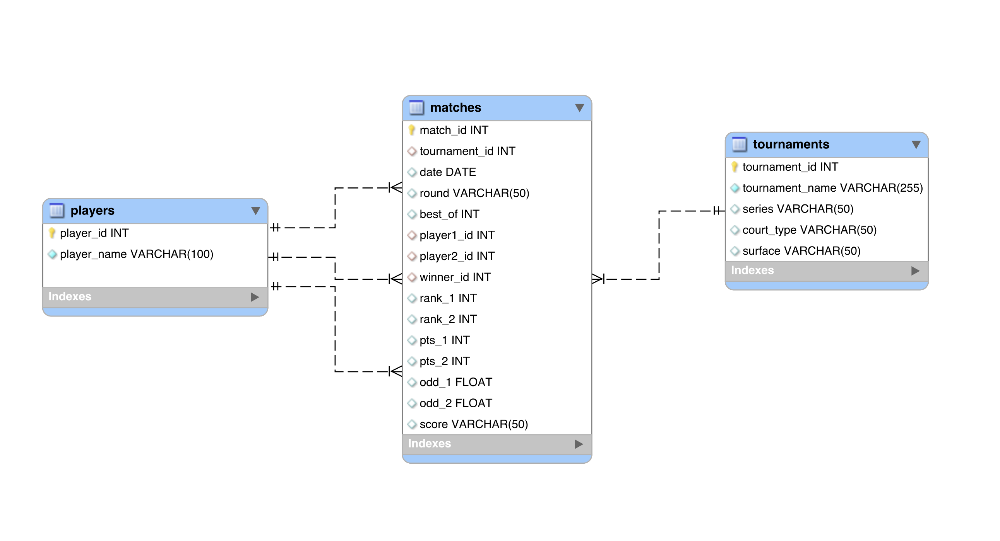

# ATP Tennis SQL Analytics (2000–2025)

## Project Overview
This project analyzes **ATP tennis matches from 2000–2025** using **MySQL**.  
It demonstrates the full data pipeline:
1. **Extract & Transform**: importing raw CSV data, cleaning, and handling missing values,  
2. **Load & Normalize**: building a relational database schema (`players`, `tournaments`, `matches`),  
3. **Analyze**: running advanced SQL queries for both **player** and **tournament** statistics.  

The project showcases strong SQL skills, including:
- Database design (normalization, foreign keys, referential integrity),  
- Data wrangling (ETL with staging tables, handling missing values),  
- Window functions, CTEs, conditional logic, and aggregation,  
- Analytical queries with ranking, win rates, and tournament performance.  

---

## Repository Structure

```text
ATP_Tennis_SQL_Analytics/
│
├── data/
│   └── atp_tennis.csv                 # Original dataset (CC0 Public Domain)
│
├── diagrams/
│   └── EER_Diagram.png                # Entity-Relationship Diagram (visual schema)
│
├── sql/
│   ├── ATP_Tennis_Creating_Database.sql   # Database creation & ETL
│   ├── ATP_Tennis_Players.sql             # Player-focused queries (25 queries)
│   └── ATP_Tennis_Tournaments.sql         # Tournament-focused queries (9 queries)
│
└── README.md
```
---

## Dataset
> **Important**: Do **not download** the dataset manually from Kaggle.  
> The version used in this project has been cleaned and modified — only the file included in this repository will work correctly with the provided SQL scripts.

The dataset is included directly in the repository for convenience and reproducibility.

- **File**: `data/atp_tennis.csv`  
- **Format**: CSV (tournament details, players, results, rankings, betting odds, scores)  
- **License**: Based on [Kaggle – ATP Tennis 2000–2023 Daily Pull](https://www.kaggle.com/datasets/dissfya/atp-tennis-2000-2023daily-pull), originally released under CC0 Public Domain.

---

## Database Schema
The relational schema consists of three main tables:

- **players** – list of unique players (`player_id`, `player_name`)  
- **tournaments** – tournament details (`tournament_id`, `tournament_name`, `series`, `court_type`, `surface`)  
- **matches** – match-level data (with foreign keys to players and tournaments)  

Additionally, a staging table `raw_tennis` is used during ETL for loading and cleaning data.  

---

## Entity-Relationship Diagram (EER)
To better illustrate the database structure, the project includes an **EER Diagram** (`EER_Diagram.png`).  
It shows the relationships between `players`, `tournaments`, and `matches`, as well as foreign key constraints.  



---

## How to Run

1. Make sure the file `data/atp_tennis.csv` is in the correct location  
   *(it is already included in the repository)*.

2. The script `ATP_Tennis_Creating_Database.sql` uses a relative path in `LOAD DATA LOCAL INFILE`,  
   so **no manual path update is required**:

   ```sql
   LOAD DATA LOCAL INFILE 'data/atp_tennis.csv'
   INTO TABLE raw_tennis
   ...
 
3. Run the script in **MySQL**:  
   - Creates database `atp_tennis`  
   - Cleans and normalizes raw data  
   - Populates tables (`players`, `tournaments`, `matches`)  
4. Run analysis scripts:
   - `ATP_Tennis_Players.sql` → player insights  
   - `ATP_Tennis_Tournaments.sql` → tournament insights  

---

## Example Analyses

### Player-Focused Queries (`ATP_Tennis_Players.sql`)
- **Career Stats**:
  - Matches played and won by player (#1, #2)  
  - Win rate by player, by surface, and by season (#17–19)  
- **Achievements**:
  - Top 10 players per year by finals won (#3)  
  - Grand Slam champions (#14, #22)  
  - Players with most tournament titles (#13, #21)  
- **Upsets & Betting**:
  - Largest ranking gap upsets (#7)  
  - Underdog wins based on betting odds (#8–10)  
- **Rivalries**:
  - Most frequent matchups overall and in finals (#11–12, #23–24)  
  - Matches with rare scores (6–0 6–0) (#25)  

### Tournament-Focused Queries (`ATP_Tennis_Tournaments.sql`)
- **Participation**:
  - Number of players per tournament & season (#1)  
- **Upsets**:
  - Favourite vs underdog win rates by tournament (#2)  
  - Top 20 tournaments with highest upset rates (#3)  
- **Tournament Breakdown**:
  - Count by surface, court type, and series (#4–7)  
  - Identifying Grand Slams (#8)  
  - Best-of-five format tournaments (#9)  

---

## Key SQL Features Demonstrated
- **CTEs & Window Functions** (`RANK`, `ROW_NUMBER`)  
- **Aggregations** (`COUNT`, `SUM`, `ROUND`)  
- **Joins & Subqueries** (self-joins for matchups, conditional joins)  
- **Conditional Logic** (`CASE`, upset detection, betting outcomes)  
- **Data Cleaning** (converting invalid `-1` values to `NULL`)  

---

## Tech Stack
- **SQL Dialect**: MySQL 8+  
- **Dataset**: Kaggle ATP Tennis (2000–2023)  
- **Focus Areas**: ETL, database design, analytical SQL  

---

## License
This project is for **educational and portfolio purposes only**.  
Data belongs to the original Kaggle dataset authors.

